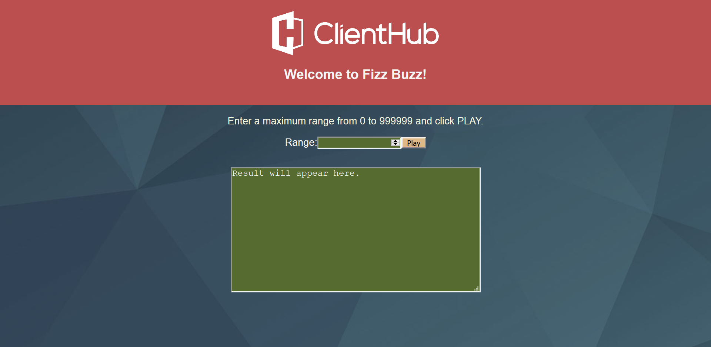
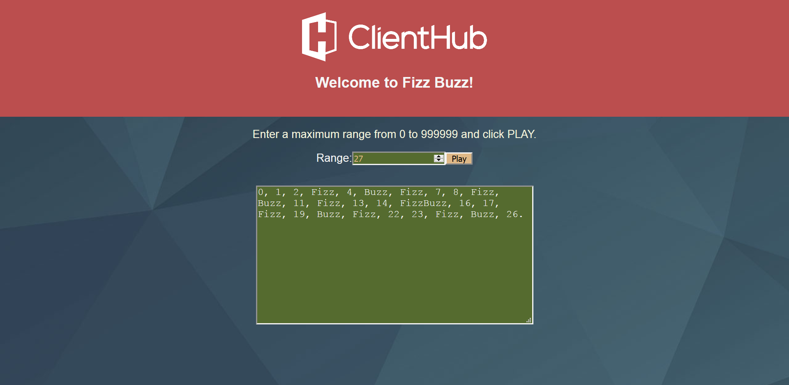

# lake-missoula

## fizz buzz demonstration.

Note:  If you didn't know (and I didn't - lol), "Fizz Buzz" was, and is, an old English
       game to help teach children about mathematical division.  Players would take turns
       counting up from zero by one, replacing any number evenly divisible by 15 with the 
       word "FizzBuzz", numbers evenly divisible by 4 with "Buzz", and by 3 with "Fizz".

### Architecture:
	
  1.  A google cloud function that accepts a range, plays the game in that range,
      and returns the result.  This function will default to 100 if a numeric value
      is absent, and if the range value is present but not a number then it will
      return:  "Input must be a number, or absent for default."

      For example: 
 
      https://us-central1-sage-yeti-217606.cloudfunctions.net/fizzBuzz?max_range=33

      returns:

      0, 1, 2, Fizz, 4, Buzz, Fizz, 7, 8, Fizz, Buzz, 11, Fizz, 13, 14, FizzBuzz, 16, 
      17, Fizz, 19, Buzz, Fizz, 22, 23, Fizz, Buzz, 26, Fizz, 28, 29, FizzBuzz, 31, 32.

  2.  A client packaged in a Docker container that will:
      *  Accept ENV override params for:
         -  The FUNCTION_URL -- this is required.
         -  MAX_RANGE        -- this is optional.  note:  The client specification calls for
                                defaulting this to 100, the server does that as well, this 
                                seems redundant and should be discussed.

  3.  A bonus client built as a React.js app that accepts a range through its    
      webapp UI, then (using axios as specified), gets the game result from the
      cloud function and displays it in the UI.

### Installation and Setup:

Note:  If you are doing Docker on Windows:   
  Straight Docker needs Hyper-V hence Windows 10 (will directly on Windows)
  If still on Windows 7 or 8 you need to install Docker-Toolbox  
    (so Docker will run inside Virtual Box instead of directly on Windows)  

  https://docs.docker.com/toolbox/  

  (Sadly you *will* eventually be forced to upgrade to Windows 10, 
   if not by somebody else, then by Docker eventually...)

  
  1.  Clone the repository to your machine:  
      * On the command line, get into the directory you want to be the *parent* of the project directory.   
      * Do:  git clone https://github.com/Aempyre/lake-missoula.git

  2.  Build and run the docker client:
      * Open a docker quickstart command line.   
        ( your standard command line box may not be configured for docker )  
      * cd into the dockerclient directory.  
        (like cd   /c/Users/worterschmidt/areas_of_interest/projects_troutmoon/test/lake-missoula/dockerclient )
      * docker build --tag "fizzbuzz-dockerclient" .  
        ( make sure you have that trailing dot! )   
        ( and ignore if you get this message:   
          "SECURITY WARNING: You are building a Docker image from Windows against a    
           non-Windows Docker host. All files and directories added to build context   
           will have '-rwxr-xr-x' permissions. It is recommended to double check and   
           reset permissions for sensitive files and directories.)   
      * docker run fizzbuzz-dockerclient   
  
  3.  Buld and run the bonus client:
      * cd into the bonusclient directory.
      * Do:  npm start 
      * Go:  to the indicated localhost / port address using your web browser.
      * Enter: a range in the UI and click "Play".

### Run:

  1.  Just run the backend service using browser address bar:   
      https://us-central1-sage-yeti-217606.cloudfunctions.net/fizzBuzz?max_range=88

  2.  Run the docker client:   
      * docker run fizzbuzz-dockerclient

  3.  To test the java client that goes in the docker client without using docker:   
      * ./build.sh
      * ./testwithoutdocker.sh         
        (note comments in the testwithoutdocker script about command line args)

  4.  To run the bonus client:   
      * After starting the bonus client app as indicated above,
      * Navigate your browser to the address the startup script will display.
       (It should be:  http://localhost:3000/ )
    
    Ready to play:   
   

    Result of game:   
    
 